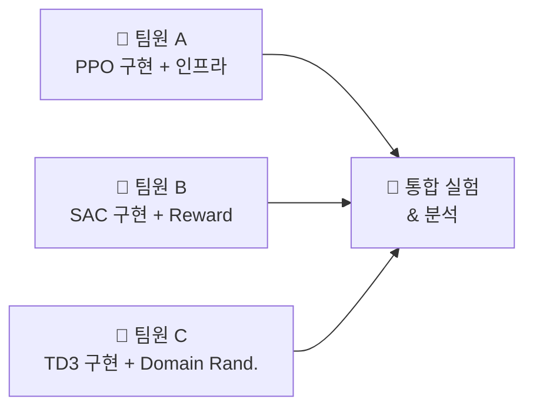

# 🤖 MuJoCo 연속 제어 환경에서의 강화학습 알고리즘 비교 및 Reward Engineering 연구

> **서강대학교 강화학습 프로젝트 기획서**
> 마감: 2026년 6월 12일 (금) 오후 11시 59분

---

## 1. 프로젝트 개요

### 1.1 연구 목표

MuJoCo 물리 시뮬레이션 기반의 **연속 제어(Continuous Control)** 환경에서, 대표적인 강화학습 알고리즘 3종(SAC, PPO, TD3)을 **직접 구현**하고, 다양한 실험 조건에서의 성능을 체계적으로 비교·분석합니다.

단순한 알고리즘 적용을 넘어, **Reward Shaping**과 **Domain Randomization** 기법을 도입하여 "어떤 조건에서 어떤 알고리즘이 왜 더 잘 작동하는가"에 대한 깊이 있는 인사이트를 도출하는 것이 핵심 목표입니다.

### 1.2 프로젝트 차별화 포인트

| 차별점 | 설명 |
|---|---|
| 🔧 **직접 구현** | Stable-Baselines3 등 기존 라이브러리에 의존하지 않고 PyTorch로 알고리즘을 직접 구현 |
| 🎯 **Reward Engineering** | 기본 reward 외에 커스텀 reward 함수를 설계하여 학습 효율 변화를 실험 |
| 🌪️ **Domain Randomization** | MuJoCo 물리 파라미터(마찰, 질량, 중력 등)를 변경하며 정책의 로버스트니스 평가 |
| 📊 **체계적 실험 설계** | 다수의 random seed, 신뢰구간, ablation study를 통한 신뢰성 있는 결과 도출 |

---

## 2. 기술 스택 및 환경

### 2.1 개발 환경

```
Python 3.10+
PyTorch 2.x          # 신경망 및 알고리즘 구현
Gymnasium 1.x        # MuJoCo 환경 인터페이스  
MuJoCo 3.x           # 물리 시뮬레이션 엔진 (무료 오픈소스)
NumPy / Matplotlib   # 데이터 처리 및 시각화
Weights & Biases     # 실험 로깅 및 추적 (선택)
```

### 2.2 대상 환경 (3종)

| 환경 | 난이도 | State 차원 | Action 차원 | 특징 |
|---|---|---|---|---|
| `HalfCheetah-v5` | ⭐⭐ | 17 | 6 | 전진 달리기, 빠른 학습 수렴 |
| `Ant-v5` | ⭐⭐⭐ | 27 | 8 | 4족 보행, 높은 차원의 제어 |
| `Humanoid-v5` | ⭐⭐⭐⭐ | 376 | 17 | 인간형 보행, 고차원 + 불안정 |

> [!TIP]
> 3가지 환경을 난이도 순으로 선정하여, 알고리즘의 **확장성(scalability)**을 분석할 수 있습니다.

---

## 3. 구현할 알고리즘 (3종)

### 3.1 PPO (Proximal Policy Optimization)

- **유형**: On-policy, Actor-Critic
- **핵심 아이디어**: Clipped surrogate objective로 정책 업데이트 폭 제한
- **장점**: 구현 단순, 안정적 학습
- **담당**: 팀원 A

### 3.2 SAC (Soft Actor-Critic)

- **유형**: Off-policy, Maximum Entropy RL
- **핵심 아이디어**: 보상 최대화 + 엔트로피 최대화 (탐색-활용 균형)
- **장점**: 샘플 효율성 우수, 연속 제어에 강함
- **담당**: 팀원 B

### 3.3 TD3 (Twin Delayed DDPG)

- **유형**: Off-policy, Deterministic Policy Gradient
- **핵심 아이디어**: Twin Q-network + Delayed policy update + Target policy smoothing
- **장점**: Q-value 과대추정 문제 해결
- **담당**: 팀원 C

---

## 4. 실험 설계

### 4.1 기본 실험: 알고리즘 성능 비교

```
3 알고리즘 × 3 환경 × 5 random seeds = 45 실험
```

**평가 지표:**
- Episode Return (학습 곡선)
- 수렴 속도 (목표 reward 도달 시간)
- 최종 성능 (마지막 100 에피소드 평균)
- 학습 안정성 (reward 표준편차)

### 4.2 Reward Shaping 실험

각 환경에서 **기본 reward**와 **커스텀 reward**를 비교:

| 환경 | 기본 Reward | 커스텀 Reward (예시) |
|---|---|---|
| HalfCheetah | 전진 속도 - 제어 비용 | + 에너지 효율 보너스 + 자세 안정성 페널티 |
| Ant | 전진 속도 - 제어 비용 - 접촉 비용 | + 직진성 보너스 + 높이 유지 보상 |
| Humanoid | 전진 속도 - 제어 비용 | + 균형 유지 보상 + 보행 주기성 보너스 |

### 4.3 Domain Randomization 실험

MuJoCo XML을 수정하여 물리 파라미터를 무작위화:

- **마찰 계수**: 기본값 ±30%
- **바디 질량**: 기본값 ±20%
- **관절 감쇠(damping)**: 기본값 ±25%

> 질문: "randomized 환경에서 학습한 정책이 기본 환경에서도 잘 작동하는가?"

### 4.4 Ablation Study

각 알고리즘의 핵심 hyperparameter에 대한 민감도 분석:

| 알고리즘 | 분석 대상 Hyperparameter |
|---|---|
| PPO | clip ratio (ε), GAE lambda, epoch 수 |
| SAC | 엔트로피 계수 (α), 자동 조절 vs 고정 |
| TD3 | policy delay, target smoothing 노이즈 |

---

## 5. 팀 구성 및 역할 분담

### 팀원별 역할



| 역할 | 팀원 A | 팀원 B | 팀원 C |
|---|---|---|---|
| **알고리즘** | PPO 구현 | SAC 구현 | TD3 구현 |
| **공통 인프라** | 학습 루프, 로깅, 평가 코드 | Replay Buffer, 네트워크 모듈 | 환경 래퍼, 시각화 유틸 |
| **실험 담당** | 기본 성능 비교 + Ablation | Reward Shaping 실험 | Domain Randomization 실험 |
| **보고서** | 서론 + 실험 셋업 | 결과 분석 + 시각화 | 토의 + 결론 + README |

> [!IMPORTANT]
> 공통 모듈(네트워크, 버퍼, 환경 래퍼 등)을 먼저 만들고 알고리즘 구현에 들어가야 효율적입니다.

---

## 6. 프로젝트 일정 (6주)

| 주차 | 기간 | 목표 | 산출물 |
|---|---|---|---|
| **1주** | 5/1 ~ 5/7 | 환경 세팅 + 공통 인프라 구축 | 프로젝트 구조, 공통 모듈 (네트워크, 버퍼, 환경 래퍼, 로깅) |
| **2주** | 5/8 ~ 5/14 | 알고리즘 개별 구현 (각자 1개씩) | PPO, SAC, TD3 초기 구현 + HalfCheetah에서 학습 확인 |
| **3주** | 5/15 ~ 5/21 | 알고리즘 디버깅 + 기본 실험 수행 | 3개 환경에서의 기본 성능 결과 |
| **4주** | 5/22 ~ 5/28 | 심화 실험 (Reward Shaping + Domain Rand.) | Reward/Domain 실험 결과 |
| **5주** | 5/29 ~ 6/4 | Ablation Study + 추가 실험 + 결과 분석 | 전체 실험 결과 + 분석 |
| **6주** | 6/5 ~ 6/12 | 보고서 작성 + 코드 정리 + README | 최종 PPT + GitHub 리포지토리 |

> [!WARNING]
> **3주차까지 기본 알고리즘이 동작하지 않으면 위험합니다.** 2주차에 최소 HalfCheetah에서 학습이 되는 것을 확인해야 합니다.

---

## 7. 프로젝트 구조 (예상)

```
rl-mujoco-comparison/
├── README.md                    # 프로젝트 설명 + 실행 방법
├── requirements.txt
├── configs/                     # Hyperparameter YAML 설정
│   ├── ppo_halfcheetah.yaml
│   ├── sac_ant.yaml
│   └── ...
├── src/
│   ├── common/                  # 공통 모듈
│   │   ├── networks.py          # Actor, Critic 네트워크
│   │   ├── buffer.py            # Replay Buffer, Rollout Buffer
│   │   ├── env_wrapper.py       # 환경 래퍼 (Domain Randomization 포함)
│   │   ├── logger.py            # 학습 로깅
│   │   └── evaluator.py         # 평가 유틸
│   ├── algorithms/              # 알고리즘 구현
│   │   ├── ppo.py
│   │   ├── sac.py
│   │   └── td3.py
│   ├── rewards/                 # 커스텀 Reward 함수
│   │   ├── halfcheetah_rewards.py
│   │   ├── ant_rewards.py
│   │   └── humanoid_rewards.py
│   └── train.py                 # 통합 학습 스크립트
├── scripts/                     # 실험 실행 스크립트
│   ├── run_baseline.sh
│   ├── run_reward_shaping.sh
│   └── run_domain_rand.sh
├── results/                     # 실험 결과 저장
│   ├── plots/
│   └── logs/
└── report/                      # 보고서
    └── presentation.pptx
```

---

## 8. 예상 결과 및 기대 효과

### 8.1 예상 결과

- **SAC**가 대부분의 MuJoCo 환경에서 **샘플 효율성** 면에서 우수할 것으로 예상
- **PPO**가 **학습 안정성** 면에서 가장 일관된 성능을 보일 것으로 예상
- **TD3**가 SAC와 유사하나, 엔트로피 부재로 탐색 부족 가능성
- **Reward Shaping**을 통해 Humanoid 같은 어려운 환경에서의 학습 효율이 유의미하게 개선될 것으로 예상
- **Domain Randomization** 정책은 기본 환경에서 약간의 성능 저하가 있으나, 파라미터 변동에 대해 더 로버스트할 것으로 예상

### 8.2 학문적 기대 효과

- 연속 제어 RL의 핵심 알고리즘에 대한 깊은 이해
- "어떤 문제에 어떤 알고리즘을 선택해야 하는가"에 대한 실용적 가이드라인 제시
- Reward Engineering의 중요성과 설계 원칙에 대한 실험적 근거 확보

---

## 9. 평가 기준 대응 전략

| 평가 항목 (배점) | 대응 전략 |
|---|---|
| **문제 정의 및 환경 구현 (25점)** | MuJoCo 3종 환경 + 커스텀 Reward + Domain Randomization 래퍼로 환경 커스터마이징 입증 |
| **알고리즘 구현 및 실험 설계 (30점)** | 3개 알고리즘 직접 구현 + 체계적 실험 매트릭스 (45+ 실험) |
| **결과 분석 및 해석 (30점)** | 학습 곡선, 성능 테이블, 신뢰구간 그래프, ablation 분석으로 풍부한 시각화 + 인사이트 |
| **보고서 및 코드 완성도 (15점)** | 깔끔한 GitHub 구조, 상세한 README, 재현 가능한 실험 스크립트 |

---

## 10. 리스크 관리

| 리스크 | 가능성 | 대응 방안 |
|---|---|---|
| Humanoid 학습 실패 | 중 | HalfCheetah, Ant 결과로 대체 + 실패 분석도 보고서에 포함 |
| 알고리즘 버그로 학습 지연 | 중 | 논문의 공식 수도코드를 참조하되, 코드는 직접 작성. 2주차까지 기본 동작 확인 필수 |
| 실험 시간 부족 | 하 | CPU 기반 시뮬레이션이므로 병렬 실행 가능. 필요 시 Google Colab GPU 활용 |
| 팀원 간 코드 통합 이슈 | 중 | 1주차에 공통 인터페이스 확정, GitHub Branch 전략 수립 |

---

> [!NOTE]
> 본 프로젝트는 핸드아웃의 **2번째 권장 옵션**(논문 재현 + 자체 실험)과 **3번째 옵션**(Gymnasium 문제 해결)을 결합한 접근입니다. 알고리즘을 직접 구현하면서도 Reward Shaping/Domain Randomization이라는 자체적인 연구 질문을 추가하여 차별화했습니다.
